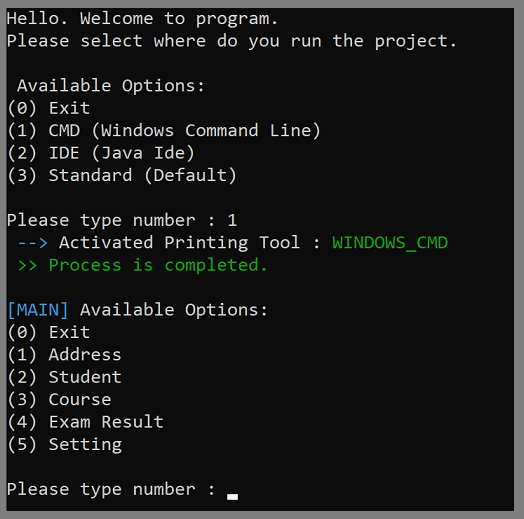
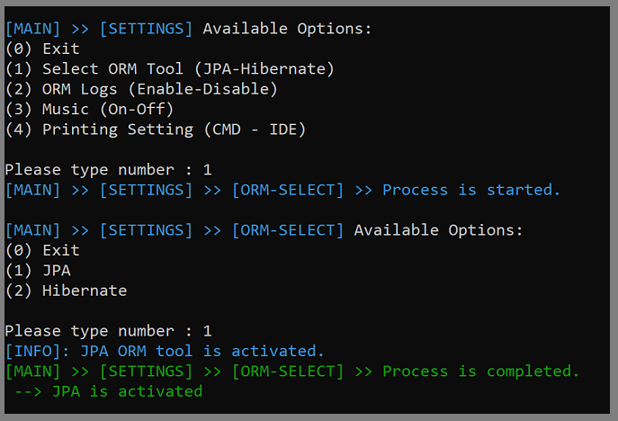
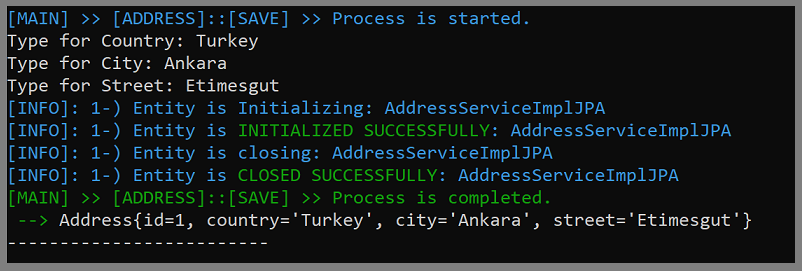
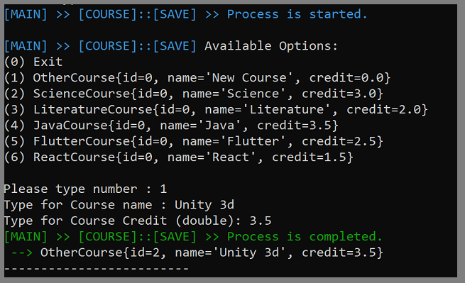
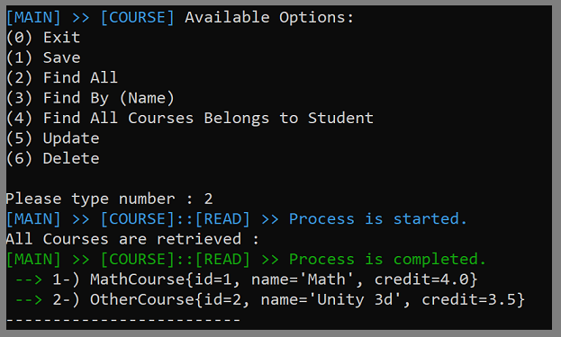
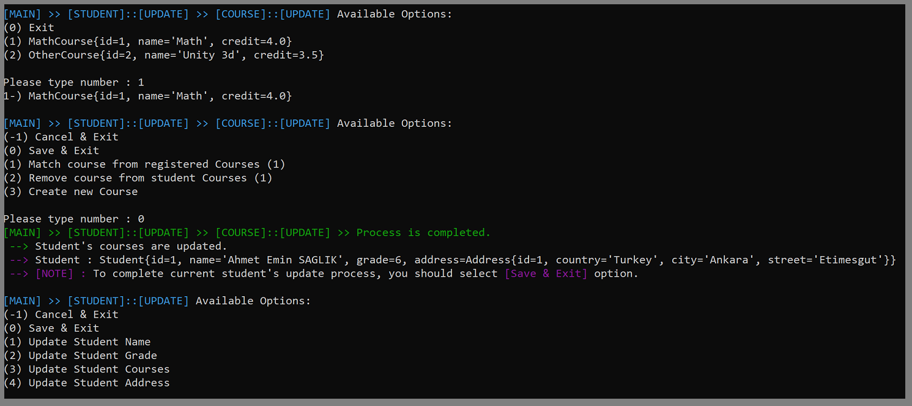
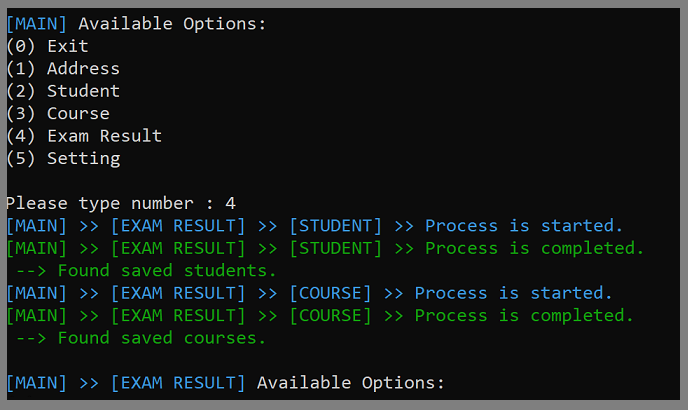

# <i>Hibernate-vs-Jpa-Implementation </i>

## Content
<ol>
        <a href="#about-project"><li>About The Project</li></a>
        <a href="#why-project-created"><li>Why The Project Is Created?</li></a>
        <a href="#used-technologies"><li>Used Technologies</li></a>
        <a href="#image"><li>Images </li></a>
                <ol> 
                        <a href="#windows-cmd-output"><li>Windows CMD Output</li></a>
                        <a href="#intelij-idea-output"><li> Intellij IDEA Output</li></a>
                </ol>
        </li>
        <a href="#requirements"><li>Requirements</li></a>
         <a href="#quick-start"><li>Quick Start</li></a>
         <ol>
	<a href="#run-in-cmd"><li>Run in CMD</li></a>
        <!-- <a href="#run-in-docker"><li>Run in Docker</li></a>-->
         </ol>
         </li>
        <a href="#installation"><li>Installation (Run In IntelliJ IDEA)</li></a>

<!--         <a href="#version-difference"><li>Version Difference</li></a> -->

</ol>

## <span id="about-project">1-) About The Project</span>

***Hibernate-vs-JPA-Implementation*** is a console application designed to demonstrate the use of both JPA (Java Persistence API) and Hibernate in core Java. This project includes classes for managing *addresses*, *students*, *courses*, and *exam results*. Users can easily select either JPA or Hibernate to perform database operations, and the application features color-coded outputs for a more user-friendly console experience.

Most important part of this project is providing user the shortcut terminal commands to process.

* Lower cases present CRUD operation.
* Upper cases present Object.


###  Terminal - Core Commands

| Example Using | Meaning                | 
|:-------------:|:-----------------------|
|      -q       | Cancel Current Process |
|      -e       | Exit Program           |
|      -h       | Help                   |


###  Terminal - Process Data Commands

| Shortcut  Command | Long  Command | Shortcut  Object   | Normal Object |
|:-----------------:|:--------------|--------------------|:--------------|
|        -c         | create        | -A                 | Address       |
|        -r         | read          | -S                 | Student       |
|        -u         | update        | -C                 | Course        |
|        -d         | delete        | -ER                | ExamResult    |

###  Terminal Commands - Example Using

| Example Using (Shortcut-Commands) | Example Using (Standard-Commands) | Meaning              | 
|:---------------------------------:|:----------------------------------|:---------------------|
|               -c -A               | create Address                    | Creates Address      |
|               -r -S               | read Student                      | Read Student         |
|               -u -C               | update Course                     | Updates Course       |
|              -d -ER               | delete ExamResult                 | Deletes  Exam Result |


## <span id="why-project-created">2-) Why The Project Is Created?</span >
During interviews, I was asked a few times about my experience with JPA and Hibernate tools. While I mentioned that I use JPA within Spring Boot, some interviewers preferred not to consider that experience, as JPA is integrated into Spring Boot. To address this, I decided to create a project that allows for easy switching between JPA and Hibernate, enabling a clear demonstration of both frameworks in action. This project serves as a practical example of JPA and Hibernate implementations.

## <span id="used-technologies">3-) Used Technologies</span>

* Core Technologies:
    * JAVA SE
    * Log4j
    * MySQL
* Dependencies:
    * org.hibernate.hibernate-core:6.2.8.Final
    * log4j.log4j:1.2.17
    * mysql.mysql-connector-java:8.0.31
    * org.junit.jupiter.junit-jupiter:RELEASE
    * javazoom.jlayer:1.0.1
    * com.ahmeteminsaglik:console-colorful-text:1.1

## <span id="image">4-) Images </span>


[//]: # (### <span id="windows-cmd-output"><li> Windows CMD Output </li> </span>)
<details>
<summary> <span id="windows-cmd-output" style="font-size: 20px;"> Windows CMD Output  </span></summary>


### 1. Activating CMD Printing Tool.
 <br><br>

### 2. Activating ORM Logs
 <br><br>

### 3.  Activating JPA
<br><br>

### 4. Saving Address Data (ORM Logs from for JPA Implementation)
<br> <br>

### 5. Find All Address Data (ORM Logs from for Hibernate Implementation)
<br> <br>

### 6. Deactivating ORM Logs
<br> <br>

### 7. Saving Student Data
<br> <br>

### 8. Find All Student Data
<br> <br>

### 9. Saving New Course - Math Course
<br> <br>

### 10. Saving New Course - Other Course
<br> <br>

### 11. Find All Course Data
<br> <br>

### 12. Student Save process invalid input and try to save without address data.
<br> <br>

### 13. Update Student with enrolling to courses.
<br> <br>

### 14. Update Student successfull result.
<br> <br>

### 15.  Entering Exam Result process. (Checking is there any saved student and courses before do process.)
<br> <br>

### 16. Save Exam Result - Student step.
<br> <br>

### 17. Save Exam Result - Course step and score.
<br> <br>


[//]: # (### <span id="intelij-idea-output"><li> IntelliJ IDEA Output </li> </span>)

</details>

<br>

<details>
<summary> <span id="intelij-idea-output" style="font-size: 20px;"> IntelliJ IDEA Output  </span></summary>

### 1. Activating IDEA Printing Tool.
 <br><br>

### 2. Retrieve all Exam Result data.
 <br><br>

### 3. Retrieve all Exam Result data by invalid Course Name.
 <br><br>

### 4. Retrieve all Exam Result data by Course Name.
 <br><br>

</details>


## <span id="requirements">5-) Requirements</span>

* <a href="https://www.oracle.com/tr/java/technologies/javase/jdk11-archive-downloads.html">JDK 11</a>
* <a href="https://www.jetbrains.com/idea/download/?section=windows"> IntelliJ IDEA (Community Edition) </a>
* MySQL
    * Username: `root`
    * Password: ` `
    * port:: `3306`


## <span id="quick-start">6-) Quick Start </span>

### <span id="run-in-cmd"> Run In Windows CMD </span>

**1.** First of all, the project requires a running MySQL server. If you have not yet installed a MySQL server but docker desktop, then you can copy and paste the following command to your CMD to create a proper MySQL container to run the project.  
Default login credentials must be the same as given in  <a href="#requirements">requirements</a> part.   
(If you want to change login credentials please go to <a href="#installation"> installation </a> part.)

```dockerfile
docker run --name jpa-hibernate-mysql -p 3306:3306  -e MYSQL_ALLOW_EMPTY_PASSWORD=1 -d mysql
```
To test whether the MySQL container is running properly, you can copy and paste the following command.

```
mysql -u root -h 127.0.0.1 -P 3306
```

If you see the following output it means you successfully connected. So you can follow the next steps.
> Welcome to the MySQL monitor.  Commands end with; or \g.
<br> Your MySQL connection id is 11
<br> Server version: 9.0.0 MySQL Community Server - GPL

**2.** Copy and paste the following command in your cmd.
<br>

```
git clone https://github.com/AhmetEminSaglik/Hibernate-vs-Jpa.git
```
**3.** Copy and paste the following command into your cmd.
```
java -jar  Hibernate-vs-Jpa/Jpa-vs-Hibernate-Implementation.jar
```


<!-- 
### <span id="run-in-docker"> Run In Docker </span>

**1.** Copy and paste the following command in your cmd.

To run `v1.0`
```
docker run -it ahmeteminsaglik/colorful-text-console:1.0
```

To run `v1.1`
```
docker run -it ahmeteminsaglik/colorful-text-console:1.1
```

<br>
-->

## <span id="installation">7-) Installation (Run In IntelliJ IDEA)</span>
**1.** Copy and paste the following command in your cmd.

```
git clone https://github.com/AhmetEminSaglik/Hibernate-vs-Jpa.git
```

**2.** To run this project one dependency must be added to the project. You can go to following link to figure out how to install it directly to the project.

* <a href="https://github.com/AhmetEminSaglik/Console-Colorful-text?tab=readme-ov-file#installation"> Colorful Print Tool Module </a>

[//]: # (* <a href="https://github.com/AhmetEminSaglik/MusicPlayerForConsoleApp?tab=readme-ov-file#installation"> Music Player Console Module </a>)

**3.** If you want to change mysql connect data then update both JPA and Hibernate configuration files.
* JPA configuration file :
    * src/main/resources/META-INF/`persistence.xml` (update both `persistenceUnitRealProject` and `persistenceUnitTest`)
```xml
<property name="jakarta.persistence.jdbc.url"
          value="jdbc:mysql://localhost:YOUR_PORT/school_db_test?createDatabaseIfNotExist=true"/>
<property name="jakarta.persistence.jdbc.user" value="YOUR_USERNAME"/>
<property name="jakarta.persistence.jdbc.password" value="YOUR_PASSWORD"/>
```
* Hibernate configuration file :
    * src/main/resources/hibernate.cfg.xml/`hibernate.cfg.xml`
    * src/main/resources/hibernate.cfg.xml/`hibernate_test.cfg.xml`
```xml
<property name="connection.url">jdbc:mysql://localhost:YOUR_PORT/school_db?allowPublicKeyRetrieval=true&amp;useSSL=false&amp;createDatabaseIfNotExist=true</property>
<property name="connection.username">YOUR_USERNAME</property>
<property name="connection.password">YOUR_PASSWORD</property>
```